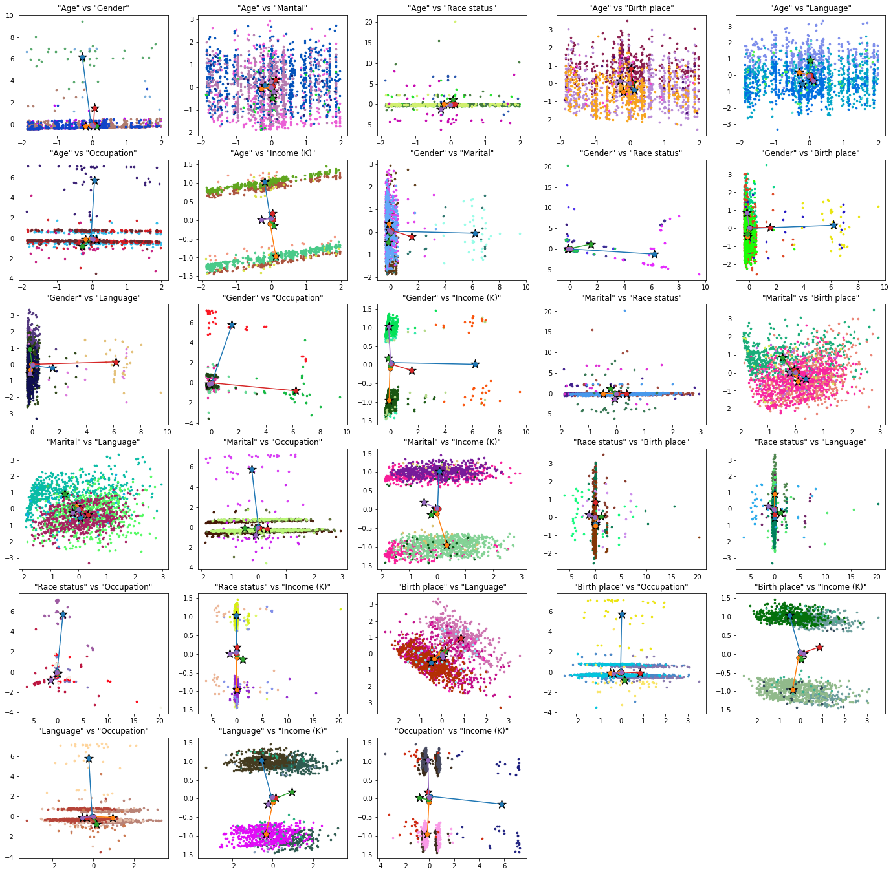
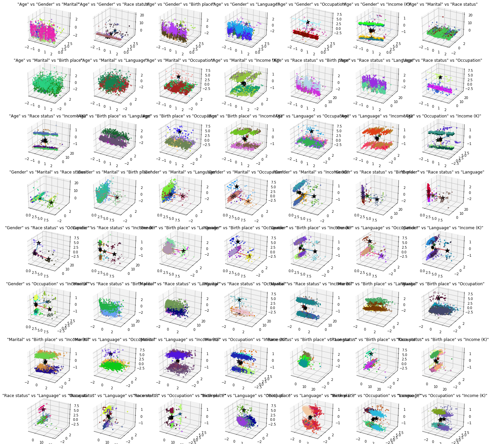

# PrivacyEnhancingTechnologies-projects

This repository contains the projects that I implemented during the course [COE449-PrivacyEnhancingTechnologies at KFUPM](http://www.kfupm.edu.sa/departments/coe/Pages/en/Undergraduate-Courses.aspx) tought by Assistant Professer [Muhamad Felemban](https://faculty.kfupm.edu.sa/coe/mfelemban/).

<!-- ## Course Catalog Description

The objective of this course is to provide students with a solid understanding of a set of core techniques for achieving information security and privacy.
The course will cover theoretical and practical aspects of the state-of-the-art privacy-enhancing technologies, and their applications in modern systems. Students will be able to apply the knowledge acquired in this course to design new privacy-enhancing technologies for emerging systems.
In addition, the course will equip students with skills pertaining to evaluate and criticize systems and infrastructures in terms of preserving the privacy and security of users. -->

There are multiple projects/assignments in this repository. The bellow is a summary (sorted by most interesting first).

## 1. [Project: Differentially Private KMeans Clustering](proj-Assign2_DifferentialPrivacy/)

See [notebook here](./proj-DifferentiallyPrivate_Kmeans_clustering/proj_DP_kmeans.ipynb) where it all comes together.

In the project, differentially-private (DP) Kmeans ([see article](./proj-DifferentiallyPrivate_Kmeans_clustering/https://journals.plos.org/plosone/article?id=10.1371/journal.pone.0206832)) is implemented compared with regular kmeans algorithms.
Also multiple datasets are tested and compared.

The most interesting and novel part of this project, is the technique I used to visualize data in higher than 3 dimensions.

### Visualizing data above 3D

I used a cartesian product to view every combination of the features and visualize only a subset of the features at a time, this is like looking at the data but from different angles.

The bellow are 8 dimension projected to 2D space (using the feature combination)

The bellow is the same 8 dimensional data, projected to 3D

### Comparing KMeans cluster centers

The goal is to compare the cluster centers between DP_kmeans and regular kmeans, **where do they move? what's the affect of DifferentialPrivacy on kmeans?** that's what we'll answer here.

The output of the kmeans clustering is the assignment of each point to a center.  
But when comparing 2 or more kmeans outputs for comparison, how do you know which center corresponds to the other one?

What I did was that I used aligned the centers such that I minimize the total distance. So in the above images, the circles are the regular kmeans centers, and the stars are the DifferentiallyPrivate kmeans centers, and I drew a line between them as well.

## 2. [Assignment1 (miniproject): KAnonymization](Assign1_kAnonymization/)

[Click here](Assign1_kAnonymization/assignment1_k_anonymization.ipynb) for notebook.

This project implements [KAnonymization](https://en.wikipedia.org/wiki/K-anonymity) using the [Mondrian](Assign1_kAnonymization/https://personal.utdallas.edu/~mxk055100/courses/privacy08f_files/MultiDim.pdf) algorithm.

We also perform a linkage attack by matching two datasets and searching for common entries.

### Objectives

The objectives of this assignment is the following:

1. Conduct various type of attacks on a public dataset
2. Implement a k-anonymization algorithm, in particular, Mondrian multidimensional
3. Analyze the tradeoff between privacy and utility, and
4. Understand the difference between k-anonymization, l-diversity, and
t-closeness

## 3. [Assignment3 (miniproject): Oblivious file transfer 1-out-of-n](Assign3_ObliviousTransfer/)

Miniproject on oblivious transfer. I used Python socket programming and RSA encryption to implement this protocol.

## 4. [Assignment4: Bitcoin Fundementals](Assign4_BitcoinFundamentals/)

Written assignment on merkel trees.

## 5. [Assignment2: Differential Privacy](Assign2_DifferentialPrivacy/)

Written assignment on differential privacy mechanisms, parallel vs sequential.
