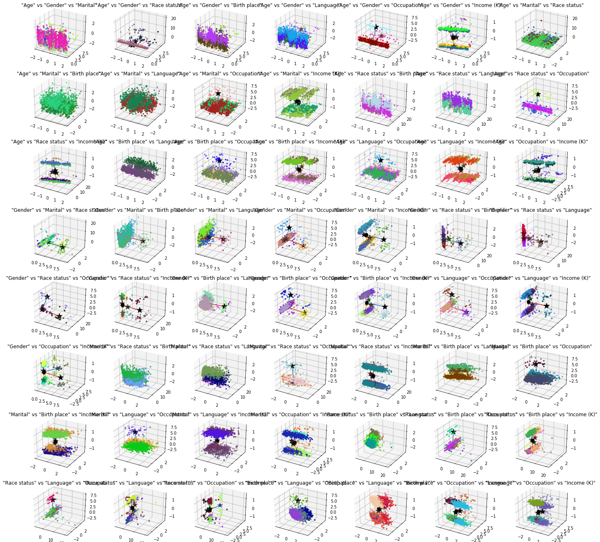

# DifferentiallyPrivate_Kmeans_clustering

See [notebook here](proj_DP_kmeans.ipynb) where it all comes together.

## About

In the project, differentially-private (DP) Kmeans ([see article](https://journals.plos.org/plosone/article?id=10.1371/journal.pone.0206832)) is implemented compared with regular kmeans algorithms.
Also multiple datasets are tested and compared.

The most interesting and novel part of this project, is the technique I used to visualize data in higher than 3 dimensions.

## Visualizing data above 3D

I used a cartesian product to view every combination of the features and visualize only a subset of the features at a time, this is like looking at the data but from different angles.

The bellow are 8 dimension projected to 2D space (using the feature combination)

The bellow is the same 8 dimensional data, projected to 3D

## Comparing KMeans cluster centers

The goal is to compare the cluster centers between DP_kmeans and regular kmeans, **where do they move? what's the affect of DifferentialPrivacy on kmeans?** that's what we'll answer here.

The output of the kmeans clustering is the assignment of each point to a center.  
But when comparing 2 or more kmeans outputs for comparison, how do you know which center corresponds to the other one?

What I did was that I used aligned the centers such that I minimize the total distance. So in the above images, the circles are the regular kmeans centers, and the stars are the DifferentiallyPrivate kmeans centers, and I drew a line between them as well.
